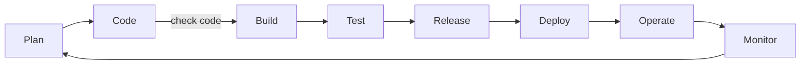

# Snyk Code check pre-commit

## 概要

[Snyk Code](https://snyk.io/product/snyk-code/)をコミット前に呼び出すためのテスト用リポジトリです。

- 各開発者がローカル環境でコミットする前
- プルリクエストを使ってコードをmainブランチにマージする前

にそれぞれ Snyk Codeによるチェックを行い、セキュアな状態を保つことが目的です。



今回は以下仕組みを活用しています。

- シンプルな git-hooksの仕組みを使ったローカル環境でのチェック
- GithubActionsを使った脆弱性スキャン

## 前準備

プロジェクト参画時、一度のみ以下設定を行う。

### コマンドのインストール

以下コマンドを利用できること

- git
- snyk
  - FYI: [Snyk CLI](https://docs.snyk.io/snyk-cli)
  - How to install: [Install or update the Snyk CLI - Snyk User Docs](https://docs.snyk.io/snyk-cli/install-the-snyk-cli)

### Snykの設定

- Snykアカウントの準備
  - ブラウザから組織のダッシュボードにアクセスできること
- Snyk CLIの認証
  - `snyk auth` を実行
  - FYI: [Authenticate the CLI with your account - Snyk User Docs](https://docs.snyk.io/snyk-cli/authenticate-the-cli-with-your-account)
- Snyk CLIの組織設定
  - デフォルトの組織で良い場合は以下設定は不要
  - `snyk config set org=組織識別子` を実施
    - FYI: [How to select the organization to use in the CLI – Support Portal | Snyk](https://support.snyk.io/hc/en-us/articles/360000920738-How-to-select-the-organization-to-use-in-the-CLI)


### pre-commitの設定

本プロジェクトルートディレクトリにて以下コマンドを実行すること。

```bash
git config --local core.hooksPath .githooks/
```
